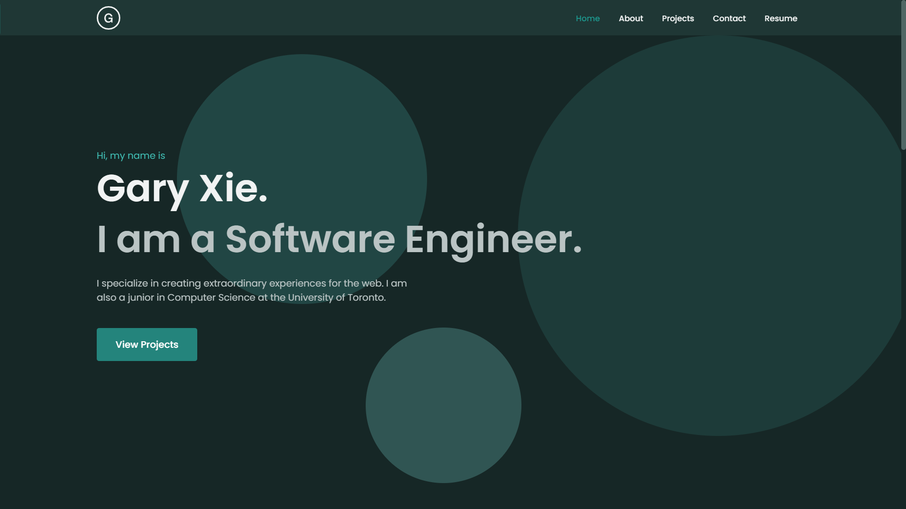

<div align="center">
  
  <h1 align="center">Gary Xie's Portfolio</h1>
  <a href="https://garyxie.me">garyxie.me</a>
  <br>
  <p>
  My portfolio website, built with Next.js and TypeScript.
  </p>
  
</div>

## Installation & Set Up

1. Clone the repository.
   ```sh
   git clone https://github.com/GaryJX/portfolio.git
   ```
2. `cd` into the project root directory.
   ```sh
   cd portfolio
   ```
3. Install dependencies.
   ```sh
   npm install
   ```
4. Start the development server.
   ```sh
   npm run dev
   ```
5. Open the application at http://localhost:3000/
